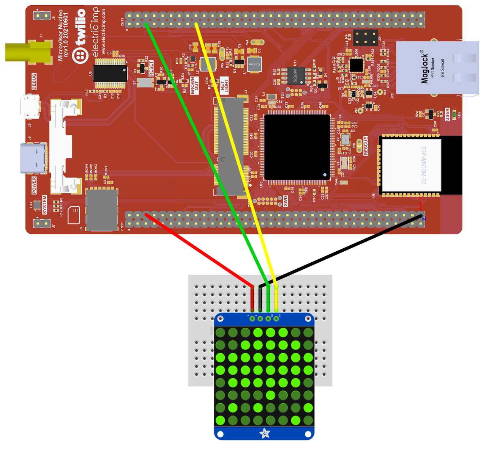

# Twilio Microvisor Weather Device Demo 3.1.0

This repo provides a basic demonstration of a sample weather monitor application. It makes use of an 8x8 matrix display to periodically present the local weather conditions, which are retrieved from the [OpenWeather API](https://openweathermap.org/api/one-call-api). The OpenWeather data is parsed using [cJSON](https://github.com/DaveGamble/cJSON).

The application is based on the [FreeRTOS](https://freertos.org/) real-time operating system and which will run on the “non-secure” side of Microvisor. FreeRTOS is included as a submodule.

The [ARM CMSIS-RTOS API](https://github.com/ARM-software/CMSIS_5) is used an an intermediary between the application and FreeRTOS to make it easier to swap out the RTOS layer for another should you wish to do so.

The application code files can be found in the [`App/`](App/) directory. The [`ST_Code/`](ST_Code/) directory contains required components that are not part of Twilio Microvisor STM32U5 HAL, which this sample code accesses as a submodule. The required `FreeRTOSConfig.h` and `stm32u5xx_hal_conf.h` configuration files are located in the [config/](config/) directory.

## Release Notes

* 3.1.0 uses [Microvisor Secrets](#microvisor-secrets) to hold the OpenWeather API key.
* 3.0.0 requires Microvisor kernel 0.5.1 or above, Twilio CLI 5.5.0 or above, and [Twilio CLI Microvisor Plugin 0.3.10](https://www.twilio.com/docs/iot/microvisor/the-twilio-cli-microvisor-plugin) or above.
* 2.0.7 adds optional [logging over UART](#uart-logging).
* 2.0.6 adds [Docker support](#docker).
* 2.0.5 has no code changes, but adds Visual Studio Code remote debugging support.
* 2.0.0 replaces earlier `printf()`-based application logging with Microvisor’s application logging system calls.

## Cloning the Repo

This repo makes uses of git submodules, some of which are nested within other submodules. To clone the repo, run:

```bash
git clone https://github.com/TwilioDevEd/microvisor-weather-device-demo.git
```

and then:

```bash
cd microvisor-weather-device-demo
git submodule update --init --recursive
```

## Repo Updates

When the repo is updated, and you pull the changes, you should also always update dependency submodules. To do so, run:

```bash
git submodule update --remote --recursive
```

We recommend following this by deleting your `build` directory.

## Requirements

You will need a Twilio account. [Sign up now if you don’t have one](https://www.twilio.com/try-twilio).

The demo makes use of the [OpenWeather API](https://openweathermap.org/api/one-call-api). To make use of this API, you will need to [set up an OpenWeather account](https://home.openweathermap.org/users/sign_up) and obtain an API key.

Get your location — or any location co-ordinates — from [Google Maps](https://www.google.co.uk/maps).

You will also need the following hardware:

* A Twilio Microvisor Nucleo Development Board. You will need to solder male header pins to the two GPIO banks on the board, or at the very least to the connected pins shown in the circuit diagram below.
* An HT16K33-based 8x8 matrix display, e.g., [Adafruit 1.2-inch 8x8 LED Matrix and Backpack](https://www.adafruit.com/product/1856).
* Four female-to-female jumper wires.

## Hardware Setup

Assemble the following circuit:



The display are shown on breakout boards which include I2C pull-up resistors. If you add the display and sensor as raw components, you will need to add pull-ups on the I2C SDA and SCL lines. You only need a single pull-up on each line.

## Software Setup

This project is written in C. At this time, we only support Ubuntu 20.0.4. Users of other operating systems should build the code under a virtual machine running Ubuntu, or with Docker.

**Note** Users of unsupported platforms may attempt to install the Microvisor toolchain using [this guidance](https://www.twilio.com/docs/iot/microvisor/install-microvisor-app-development-tools-on-unsupported-platforms).

### Docker

If you are running on an architecture other than x86/amd64 (such as a Mac with Apple silicon), you will need to override the platform when running docker. This is needed for the Twilio CLI apt package which is x86 only at this time:

```shell
export DOCKER_DEFAULT_PLATFORM=linux/amd64
```

Build the image:

```shell
docker build --build-arg UID=$(id -u) --build-arg GID=$(id -g) -t mv-weather-demo-image .
```

Run the build:

```
docker run -it --rm -v $(pwd)/:/home/mvisor/project/ \
  --env-file env.list \
  --name mv-weather-demo mv-weather-demo-image
```

**Note** You will need to have exported certain environment variables, as [detailed below](#environment-variables).

Under Docker, the demo is compiled, uploaded and deployed to your development board. It also initiates logging — hit <b>ctrl</b>-<b>c</b> to break out to the command prompt.

### Pre-requisites

#### Libraries

Under Ubuntu, run the following:

```bash
sudo apt install gcc-arm-none-eabi binutils-arm-none-eabi \
  git curl build-essential cmake libsecret-1-dev jq openssl
```

#### Twilio CLI

Install the Twilio CLI. This is required to view streamed logs and for remote debugging. You need version 4.0.1 or above.

**Note** If you have already installed the Twilio CLI using *npm*, we recommend removing it and then reinstalling as outlined below. Remove the old version with `npm remove -g twilio-cli`.

```bash
wget -qO- https://twilio-cli-prod.s3.amazonaws.com/twilio_pub.asc | sudo apt-key add -
sudo touch /etc/apt/sources.list.d/twilio.list
echo 'deb https://twilio-cli-prod.s3.amazonaws.com/apt/ /' | sudo tee /etc/apt/sources.list.d/twilio.list
sudo apt update
sudo apt install -y twilio
```

Close your terminal window or tab, and open a new one. Now run:

```bash
twilio plugins:install @twilio/plugin-microvisor
```

#### Environment Variables

Running the Twilio CLI and the Microvisor Plugin to upload the built code to the Twilio cloud for subsequent deployment to your Microvisor Nucleo Board uses the following Twilio credentials stored as environment variables. They should be added to your shell profile:

```bash
export TWILIO_ACCOUNT_SID=ACxxxxxxxxxxxxxxxxxxxxxxxxxxxxxxxx
export TWILIO_AUTH_TOKEN=xxxxxxxxxxxxxxxxxxxxxxxxxxxxxxxx
export MV_DEVICE_SID=UVxxxxxxxxxxxxxxxxxxxxxxxxxxxxxxxx
```

You can get the first two from your Twilio Console [account dashboard](https://console.twilio.com/).

Enter the following command to get your target device’s SID and, if set, its unqiue name:

```bash
twilio api:microvisor:v1:devices:list
```

Before you build the app, set the following OpenWeather environment variables:

```bash
export MVOW_LAT=<YOUR_LATITUDE_CO-ORDINATE>
export MVOW_LNG=<YOUR_LONGITUDE_CO-ORDINATE>
```

#### Microvisor Secrets

Version 3.1.0 and above uses the Twilio cloud’s secrets store to hold your OpenWeather API key securely so it is not baked into the app itself. Set this up this way:

Run:

```shell
twilio api:microvisor:v1:secrets:create --key secret-ow-api-key --value <YOUR_OW_API_KEY>
```

This will upload the API key as a key-value pair. The pair’s key is `secret-ow-api-key`. If you change this value, make sure to change the value of the `#define API_KEY_SECRET_NAME` in `openweather.h`.

The application uses this key to retrieve the API key from the cloud and hold it in RAM.

It is left as an exercise for the reader to update the application to load the device’s latitude and longitude using this method rather than local environment variables.

## Build the Deploy the Application

Run:

```bash
twilio microvisor:deploy . --devicesid ${MV_DEVICE_SID} --log
```

This will compile, bundle and upload the code, and stage it for deployment to your device. If you encounter errors, please check your stored Twilio credentials.

The `--log` flag initiates log-streaming.

## View Log Output

You can start log streaming separately — for example, in a second terminal window — with this command:

```bash
twilio microvisor:deploy . --devicesid ${MV_DEVICE_SID} --log-only
```

For more information, run

```bash
twilio microvisor:deploy --help
```

## UART Logging

You may log your application over UART on pin PD5 — pin 41 in bank CN11 on the Microvisor Nucleo Development Board. To use this mode, which is intended as an alternative to application logging, typically when a device is disconnected, connect a 3V3 FTDI USB-to-Serial adapter cable’s RX pin to PD5, and a GND pin to any Nucleo GND pin. Whether you do this or not, the application will continue to log via the Internet.

## Remote debugging

This release supports remote debugging, and builds are enabled for remote debugging automatically. Change the value of the line

```
set(ENABLE_REMOTE_DEBUGGING 1)
```

in the root `CMakeLists.txt` file to `0` to disable this.

Enabling remote debugging in the build does not initiate a GDB session — you will have to do this manually. Follow the instructions in the [Microvisor documentation](https://www.twilio.com/docs/iot/microvisor/microvisor-remote-debugging).

This repo contains a `.gdbinit` file which sets the remote target to localhost on port 8001 to match the Twilio CLI Microvisor plugin remote debugging defaults.

#### Remote Debugging Encryption

Remote debugging sessions are now encrypted. The file `app/CMakeLists.txt` generates new remote debugging keys at each build. These are placed in the `/build/app` directory, which is ignored for git commits. You will need to pass the path to the private key to the Twilio CLI Microvisor plugin to decrypt debugging data. The plugin will output this path for you.

Alternatively, generate the keys manually and pass their locations to the deploy script:

```shell
twilio microvisor:deploy . --devicesid ${MV_DEVICE_SID} \
   --privatekey /path/to/existing/private/key.pem \
   --publickey /path/to/existing/public/key.pem
```

## Copyright and Licensing

The sample code and Microvisor SDK is © 2023, Twilio, Inc. It is licensed under the terms of the [Apache 2.0 License](./LICENSE).

The SDK makes use of code © 2021, STMicroelectronics and affiliates. This code is licensed under terms described in [this file](https://github.com/twilio/twilio-microvisor-hal-stm32u5/blob/main/LICENSE-STM32CubeU5.md).

The SDK makes use [ARM CMSIS](https://github.com/ARM-software/CMSIS_5) © 2004, ARM. It is licensed under the terms of the [Apache 2.0 License](./LICENSE).

[FreeRTOS](https://freertos.org/) is © 2021, Amazon Web Services, Inc. It is licensed under the terms of the [Apache 2.0 License](./LICENSE).

[cJSON](https://github.com/DaveGamble/cJSON) is © 2009-2017 Dave Gamble and cJSON contributors. It is licensed under the terms of the [MIT License](./LICENSE.md).
